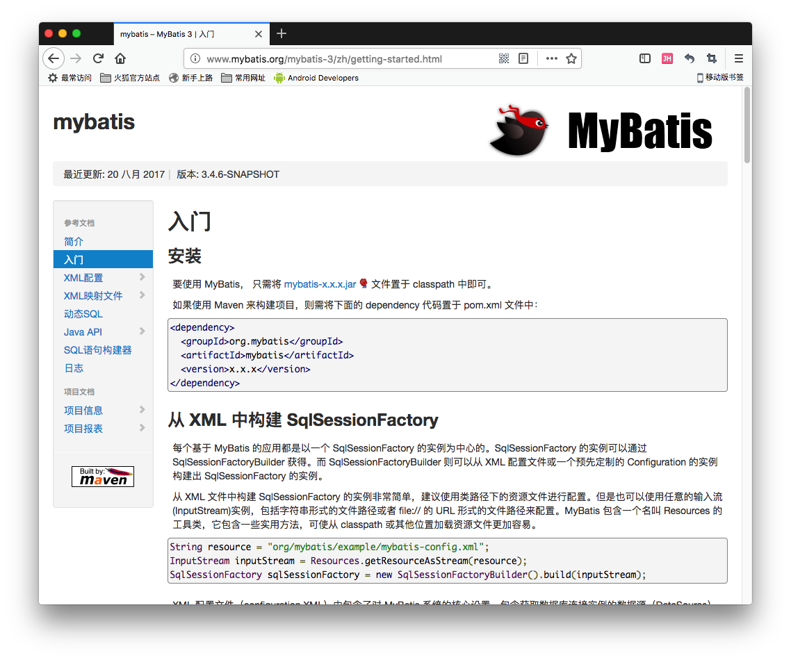
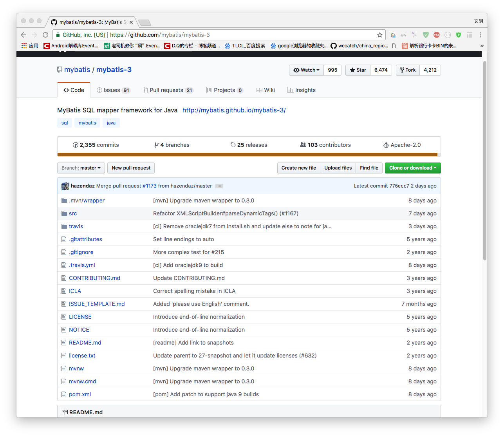

[TOC]

# MyBatis学习笔记

[SSH与SSM学习之MyBatis01——MyBatis简介](blog/01.md)

[SSH与SSM学习之MyBatis02——使用jdbc编程问题总结](blog/02.md)

[SSH与SSM学习之MyBatis03——Mybatis架构](blog/03.md)

[SSH与SSM学习之MyBatis04——Mybatis基本使用](blog/04.md)

[SSH与SSM学习之MyBatis05——根据用户名称模糊查询用户信息](blog/05.md)

[SSH与SSM学习之MyBatis06——用户添加](blog/06.md)

[SSH与SSM学习之MyBatis07——用户删除和更新](blog/07.md)

[SSH与SSM学习之MyBatis08——与Hibernate的区别和小结](blog/08.md)

[SSH与SSM学习之MyBatis09——Dao1原始Dao方式开发](blog/09.md)

[SSH与SSM学习之MyBatis10——Dao2使用mapper代理的方式](blog/10.md)

[SSH与SSM学习之MyBatis11——SqlMapConfig.xml](blog/11.md)

[SSH与SSM学习之MyBatis12——输入和输出映射](blog/12.md)

[SSH与SSM学习之MyBatis13——动态SQL](blog/13.md)

[SSH与SSM学习之MyBatis14——数据模型分析](blog/14.md)

[SSH与SSM学习之MyBatis15——一对一查询](blog/15.md)

[SSH与SSM学习之MyBatis16——一对多查询(简单)](blog/16.md)

[SSH与SSM学习之MyBatis17——一对多查询(复杂)](blog/17.md)

[SSH与SSM学习之MyBatis18——多对多查询(resultType)](blog/18.md)

[SSH与SSM学习之MyBatis19——多对多查询(resultMap)](blog/19.md)

[SSH与SSM学习之MyBatis20——延迟加载](blog/20.md)

[SSH与SSM学习之MyBatis21——resultType、resultMap、延迟加载使用场景总结](blog/21.md)

[SSH与SSM学习之MyBatis22——一级缓存](blog/22.md)

[SSH与SSM学习之MyBatis23——二级缓存](blog/23.md)

[SSH与SSM学习之MyBatis24——mybatis和ehcache缓存框架整合](blog/24.md)

[SSH与SSM学习之MyBatis25——mybatis和spring整合之基本项目创建](https://github.com/wimingxxx/mybatis_spring/tree/master/blog/25.md)

[SSH与SSM学习之MyBatis26——mybatis和spring整合之原始dao开发](https://github.com/wimingxxx/mybatis_spring/tree/master/blog/26.md)

[SSH与SSM学习之MyBatis27——mybatis和spring整合之mapper代理方法](https://github.com/wimingxxx/mybatis_spring/tree/master/blog/27.md)

[SSH与SSM学习之MyBatis28——mybatis逆向工程](https://github.com/wimingxxx/mybatis_spring/tree/master/blog/28.md)

-----

# SSH与SSM学习之MyBatis01——MyBatis简介

## 一、简介

MyBatis 本是apache的一个开源项目iBatis, 2010年这个项目由apache software foundation 迁移到了google code，并且改名为MyBatis 。2013年11月迁移到Github。

MyBatis是一个优秀的持久层框架，它对jdbc的操作数据库的过程进行封装，使开发者只需要关注 SQL 本身，而不需要花费精力去处理例如注册驱动、创建connection、创建statement、手动设置参数、结果集检索等jdbc繁杂的过程代码。

Mybatis通过xml或注解的方式将要执行的各种statement（statement、preparedStatemnt、CallableStatement）配置起来，并通过java对象和statement中的sql进行映射生成最终执行的sql语句，最后由mybatis框架执行sql并将结果映射成java对象并返回。

---

## 二、官网和下载

### 2.1 官网和文档

[http://www.mybatis.org/mybatis-3/zh/getting-started.html](http://www.mybatis.org/mybatis-3/zh/getting-started.html)

### 2.2 下载地址
MyBatis已经托管到 github上，所以可以去上面下载。

[https://github.com/mybatis/mybatis-3](https://github.com/mybatis/mybatis-3)

---

## 三、源码下载

[https://github.com/wimingxxx/mybatislearn](https://github.com/wimingxxx/mybatislearn)