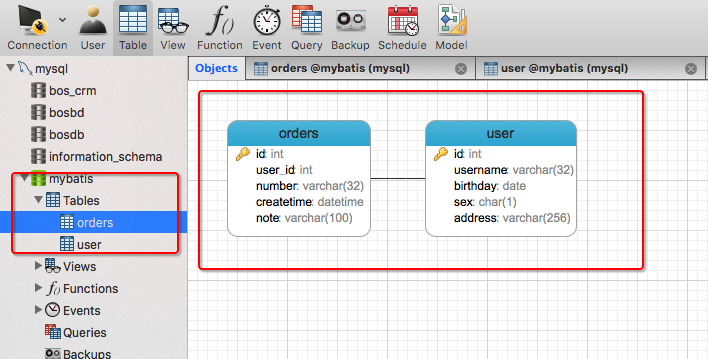
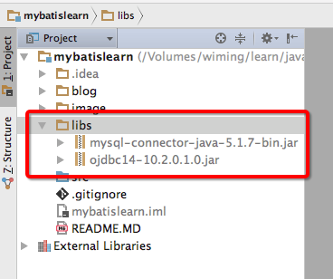

# SSH与SSM学习之MyBatis02——使用jdbc编程问题总结


## 一、创建mysql数据库

创建一个名字叫做mybatis的数据，导入一下sql

```sql
CREATE TABLE `user` (
	`id` INT (11) NOT NULL AUTO_INCREMENT,
	`username` VARCHAR (32) NOT NULL COMMENT '用户名称',
	`birthday` date DEFAULT NULL COMMENT '生日',
	`sex` CHAR (1) DEFAULT NULL COMMENT '性别',
	`address` VARCHAR (256) DEFAULT NULL COMMENT '地址',
	PRIMARY KEY (`id`)
) ENGINE = INNODB AUTO_INCREMENT = 27 DEFAULT CHARSET = utf8;

CREATE TABLE `items` (
	`id` INT (11) NOT NULL AUTO_INCREMENT,
	`name` VARCHAR (32) NOT NULL COMMENT '商品名称',
	`price` FLOAT (10, 1) NOT NULL COMMENT '商品定价',
	`detail` text COMMENT '商品描述',
	`pic` VARCHAR (64) DEFAULT NULL COMMENT '商品图片',
	`createtime` datetime NOT NULL COMMENT '生产日期',
	PRIMARY KEY (`id`)
) ENGINE = INNODB AUTO_INCREMENT = 4 DEFAULT CHARSET = utf8;

/*Table structure for table `orders` */
CREATE TABLE `orders` (
	`id` INT (11) NOT NULL AUTO_INCREMENT,
	`user_id` INT (11) NOT NULL COMMENT '下单用户id',
	`number` VARCHAR (32) NOT NULL COMMENT '订单号',
	`createtime` datetime NOT NULL COMMENT '创建订单时间',
	`note` VARCHAR (100) DEFAULT NULL COMMENT '备注',
	PRIMARY KEY (`id`),
	KEY `FK_orders_1` (`user_id`),
	CONSTRAINT `FK_orders_id` FOREIGN KEY (`user_id`) REFERENCES `user` (`id`) ON DELETE NO ACTION ON UPDATE NO ACTION
) ENGINE = INNODB AUTO_INCREMENT = 6 DEFAULT CHARSET = utf8;

/*Table structure for table `orderdetail` */
CREATE TABLE `orderdetail` (
	`id` INT (11) NOT NULL AUTO_INCREMENT,
	`orders_id` INT (11) NOT NULL COMMENT '订单id',
	`items_id` INT (11) NOT NULL COMMENT '商品id',
	`items_num` INT (11) DEFAULT NULL COMMENT '商品购买数量',
	PRIMARY KEY (`id`),
	KEY `FK_orderdetail_1` (`orders_id`),
	KEY `FK_orderdetail_2` (`items_id`),
	CONSTRAINT `FK_orderdetail_1` FOREIGN KEY (`orders_id`) REFERENCES `orders` (`id`) ON DELETE NO ACTION ON UPDATE NO ACTION,
	CONSTRAINT `FK_orderdetail_2` FOREIGN KEY (`items_id`) REFERENCES `items` (`id`) ON DELETE NO ACTION ON UPDATE NO ACTION
) ENGINE = INNODB AUTO_INCREMENT = 5 DEFAULT CHARSET = utf8;


```

添加数据

```sql
/*
SQLyog v10.2
MySQL - 5.1.72-community : Database - mybatis
*********************************************************************
*/

/*!40101 SET NAMES utf8 */;

/*!40101 SET SQL_MODE=''*/;

/*!40014 SET @OLD_UNIQUE_CHECKS=@@UNIQUE_CHECKS, UNIQUE_CHECKS=0 */;
/*!40014 SET @OLD_FOREIGN_KEY_CHECKS=@@FOREIGN_KEY_CHECKS, FOREIGN_KEY_CHECKS=0 */;
/*!40101 SET @OLD_SQL_MODE=@@SQL_MODE, SQL_MODE='NO_AUTO_VALUE_ON_ZERO' */;
/*!40111 SET @OLD_SQL_NOTES=@@SQL_NOTES, SQL_NOTES=0 */;
/*Data for the table `items` */

insert  into `items`(`id`,`name`,`price`,`detail`,`pic`,`createtime`) values (1,'台式机',3000.0,'该电脑质量非常好！！！！',NULL,'2015-02-03 13:22:53'),(2,'笔记本',6000.0,'笔记本性能好，质量好！！！！！',NULL,'2015-02-09 13:22:57'),(3,'背包',200.0,'名牌背包，容量大质量好！！！！',NULL,'2015-02-06 13:23:02');

/*Data for the table `orderdetail` */

insert  into `orderdetail`(`id`,`orders_id`,`items_id`,`items_num`) values (1,3,1,1),(2,3,2,3),(3,4,3,4),(4,4,2,3);

/*Data for the table `orders` */

insert  into `orders`(`id`,`user_id`,`number`,`createtime`,`note`) values (3,1,'1000010','2015-02-04 13:22:35',NULL),(4,1,'1000011','2015-02-03 13:22:41',NULL),(5,10,'1000012','2015-02-12 16:13:23',NULL);

/*Data for the table `user` */

insert  into `user`(`id`,`username`,`birthday`,`sex`,`address`) values (1,'王五',NULL,'2',NULL),(10,'张三','2014-07-10','1','北京市'),(16,'张小明',NULL,'1','河南郑州'),(22,'陈小明',NULL,'1','河南郑州'),(24,'张三丰',NULL,'1','河南郑州'),(25,'陈小明',NULL,'1','河南郑州'),(26,'王五',NULL,NULL,NULL);

/*!40101 SET SQL_MODE=@OLD_SQL_MODE */;
/*!40014 SET FOREIGN_KEY_CHECKS=@OLD_FOREIGN_KEY_CHECKS */;
/*!40014 SET UNIQUE_CHECKS=@OLD_UNIQUE_CHECKS */;
/*!40111 SET SQL_NOTES=@OLD_SQL_NOTES */;

```





---

## 二、创建java项目，导入驱动包和jdbc包

创建一个名字叫做 **mybatislearn** 的java项目，导入 mysql数据库驱动包和jdbc的jar包

如图



其中 ojdbc 是Oracle的驱动，没必要导入。


---


## 三、jdbc编程步骤

1、	加载数据库驱动

2、	创建并获取数据库链接

3、	创建jdbc statement对象

4、	设置sql语句

5、	设置sql语句中的参数(使用preparedStatement)

6、	通过statement执行sql并获取结果

7、	对sql执行结果进行解析处理

8、	释放资源(resultSet、preparedstatement、connection)


--

## 四、创建一个测试类测试

创建一个包 **com.qwm.mybatis.test**,创建一个java类，名称是 **JDBCTest**


```java
/**
 * @author: qiwenming(杞文明)
 * @date: 18/1/3 下午11:24
 * @className: JDBCTest
 * @description:
 *  JDBC测试
 */
public class JDBCTest {

    /**
     * jdbc 测试
     */
    @Test
    public void test1(){
        Connection connection = null;
        PreparedStatement preparedStatement = null;
        ResultSet resultSet = null;
        try{
            //加载数据库驱动
            Class.forName("com.mysql.jdbc.Driver");

            //通过驱动管理类获取数据库连接
            connection = DriverManager.getConnection("jdbc:mysql://localhost:3306/mybatis?characterEncoding=utf-8","root","xm123456");

            //定义sql ? 表示占位符
            String sql = "select * from user where username = ?";

            //获取预处理 statement
            preparedStatement = connection.prepareStatement(sql);

            //设置参数,第一个参数为sql语句中参数需要(从1开始),第二个参数为设置的参数值
            preparedStatement.setString(1,"张三");

            //向数据库发出sql执行查询,查询出结果集
            resultSet = preparedStatement.executeQuery();

            //遍历结果集
            while (resultSet.next()){
                StringBuilder sb = new StringBuilder();
                sb.append("id : " + resultSet.getString("id") + "  ,  ");
                sb.append("username : " + resultSet.getString("username") + "  ,  ");
                sb.append("birthday : " + resultSet.getString("birthday") + "  ,  ");
                sb.append("sex : " + resultSet.getString("sex") + "  ,  ");
                sb.append("address : " + resultSet.getString("address"));
                System.out.println(sb.toString());
            }

        }catch (Exception e){
            e.printStackTrace();
        }finally {
            //释放资源
            try {
                resultSet.close();
            } catch (SQLException e) {
                e.printStackTrace();
            }

        }
        if (preparedStatement != null) {
            try {
                preparedStatement.close();
            } catch (SQLException e) {
                // TODO Auto-generated catch block
                e.printStackTrace();
            }
        }
        if (connection != null) {
            try {
                connection.close();
            } catch (SQLException e) {
                // TODO Auto-generated catch block
                e.printStackTrace();
            }
        }
    }
}
```

结果

```
id : 10  ,  username : 张三  ,  birthday : 2014-07-10  ,  sex : 1  ,  address : 北京市
```

---

## 五、jdbc问题总结

1、	数据库连接创建、释放频繁造成系统资源浪费，从而影响系统性能。如果使用数据库连接池可解决此问题。

2、	Sql语句在代码中硬编码，造成代码不易维护，实际应用中sql变化的可能较大，sql变动需要改变java代码。

3、	使用preparedStatement向占有位符号传参数存在硬编码，因为sql语句的where条件不一定，可能多也可能少，修改sql还要修改代码，系统不易维护。

4、	对结果集解析存在硬编码（查询列名），sql变化导致解析代码变化，系统不易维护，如果能将数据库记录封装成pojo对象解析比较方便。


---

## 六、源码下载

[https://github.com/wimingxxx/mybatislearn](https://github.com/wimingxxx/mybatislearn)


