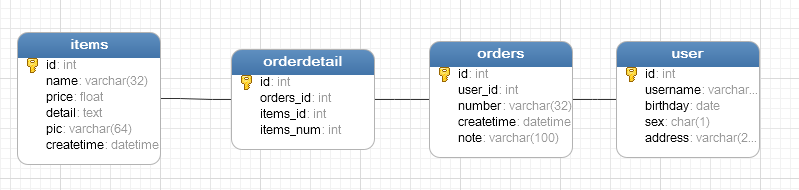

# SSH与SSM学习之MyBatis02——使用jdbc编程问题总结


## 一、创建mysql数据库

创建一个名字叫做mybatis的数据，导入一下sql

```sql
SET FOREIGN_KEY_CHECKS=0;

-- ----------------------------
-- Table structure for `orders`
-- ----------------------------
DROP TABLE IF EXISTS `orders`;
CREATE TABLE `orders` (
  `id` int(11) NOT NULL AUTO_INCREMENT,
  `user_id` int(11) NOT NULL COMMENT '下单用户id',
  `number` varchar(32) NOT NULL COMMENT '订单号',
  `createtime` datetime NOT NULL COMMENT '创建订单时间',
  `note` varchar(100) DEFAULT NULL COMMENT '备注',
  PRIMARY KEY (`id`),
  KEY `FK_orders_1` (`user_id`),
  CONSTRAINT `FK_orders_id` FOREIGN KEY (`user_id`) REFERENCES `user` (`id`) ON DELETE NO ACTION ON UPDATE NO ACTION
) ENGINE=InnoDB AUTO_INCREMENT=6 DEFAULT CHARSET=utf8;

-- ----------------------------
-- Records of orders
-- ----------------------------
INSERT INTO `orders` VALUES ('3', '1', '1000010', '2015-02-04 13:22:35', null);
INSERT INTO `orders` VALUES ('4', '1', '1000011', '2015-02-03 13:22:41', null);
INSERT INTO `orders` VALUES ('5', '10', '1000012', '2015-02-12 16:13:23', null);

-- ----------------------------
-- Table structure for `user`
-- ----------------------------
DROP TABLE IF EXISTS `user`;
CREATE TABLE `user` (
  `id` int(11) NOT NULL AUTO_INCREMENT,
  `username` varchar(32) NOT NULL COMMENT '用户名称',
  `birthday` date DEFAULT NULL COMMENT '生日',
  `sex` char(1) DEFAULT NULL COMMENT '性别',
  `address` varchar(256) DEFAULT NULL COMMENT '地址',
  PRIMARY KEY (`id`)
) ENGINE=InnoDB AUTO_INCREMENT=27 DEFAULT CHARSET=utf8;

-- ----------------------------
-- Records of user
-- ----------------------------
INSERT INTO `user` VALUES ('1', '王五', null, '2', null);
INSERT INTO `user` VALUES ('10', '张三', '2014-07-10', '1', '北京市');
INSERT INTO `user` VALUES ('16', '张小明', null, '1', '河南郑州');
INSERT INTO `user` VALUES ('22', '陈小明', null, '1', '河南郑州');
INSERT INTO `user` VALUES ('24', '张三丰', null, '1', '河南郑州');
INSERT INTO `user` VALUES ('25', '陈小明', null, '1', '河南郑州');
INSERT INTO `user` VALUES ('26', '王五', null, null, null);
```




---

## 二、创建java项目，导入驱动包和jdbc包

创建一个名字叫做 **mybatislearn** 的java项目，导入 mysql数据库驱动包和jdbc的jar包

如图


---


## 三、jdbc编程步骤

1、	加载数据库驱动

2、	创建并获取数据库链接

3、	创建jdbc statement对象

4、	设置sql语句

5、	设置sql语句中的参数(使用preparedStatement)

6、	通过statement执行sql并获取结果

7、	对sql执行结果进行解析处理

8、	释放资源(resultSet、preparedstatement、connection)


--

## 四、创建一个测试类测试

创建一个包 **com.qwm.mybatis.test**,创建一个java类，名称是 **JDBCTest**


```java
/**
 * @author: qiwenming(杞文明)
 * @date: 18/1/3 下午11:24
 * @className: JDBCTest
 * @description:
 *  JDBC测试
 */
public class JDBCTest {

    /**
     * jdbc 测试
     */
    @Test
    public void test1(){
        Connection connection = null;
        PreparedStatement preparedStatement = null;
        ResultSet resultSet = null;
        try{
            //加载数据库驱动
            Class.forName("com.mysql.jdbc.Driver");

            //通过驱动管理类获取数据库连接
            connection = DriverManager.getConnection("jdbc:mysql://localhost:3306/mybatis?characterEncoding=utf-8","root","xm123456");

            //定义sql ? 表示占位符
            String sql = "select * from user where username = ?";

            //获取预处理 statement
            preparedStatement = connection.prepareStatement(sql);

            //设置参数,第一个参数为sql语句中参数需要(从1开始),第二个参数为设置的参数值
            preparedStatement.setString(1,"张三");

            //向数据库发出sql执行查询,查询出结果集
            resultSet = preparedStatement.executeQuery();

            //遍历结果集
            while (resultSet.next()){
                StringBuilder sb = new StringBuilder();
                sb.append("id : " + resultSet.getString("id") + "  ,  ");
                sb.append("username : " + resultSet.getString("username") + "  ,  ");
                sb.append("birthday : " + resultSet.getString("birthday") + "  ,  ");
                sb.append("sex : " + resultSet.getString("sex") + "  ,  ");
                sb.append("address : " + resultSet.getString("address"));
                System.out.println(sb.toString());
            }

        }catch (Exception e){
            e.printStackTrace();
        }finally {
            //释放资源
            try {
                resultSet.close();
            } catch (SQLException e) {
                e.printStackTrace();
            }

        }
        if (preparedStatement != null) {
            try {
                preparedStatement.close();
            } catch (SQLException e) {
                // TODO Auto-generated catch block
                e.printStackTrace();
            }
        }
        if (connection != null) {
            try {
                connection.close();
            } catch (SQLException e) {
                // TODO Auto-generated catch block
                e.printStackTrace();
            }
        }
    }
}
```

结果

```
id : 10  ,  username : 张三  ,  birthday : 2014-07-10  ,  sex : 1  ,  address : 北京市
```

---

## 五、jdbc问题总结

1、	数据库连接创建、释放频繁造成系统资源浪费，从而影响系统性能。如果使用数据库连接池可解决此问题。

2、	Sql语句在代码中硬编码，造成代码不易维护，实际应用中sql变化的可能较大，sql变动需要改变java代码。

3、	使用preparedStatement向占有位符号传参数存在硬编码，因为sql语句的where条件不一定，可能多也可能少，修改sql还要修改代码，系统不易维护。

4、	对结果集解析存在硬编码（查询列名），sql变化导致解析代码变化，系统不易维护，如果能将数据库记录封装成pojo对象解析比较方便。


---

## 六、源码下载

[https://github.com/wimingxxx/mybatislearn](https://github.com/wimingxxx/mybatislearn)


