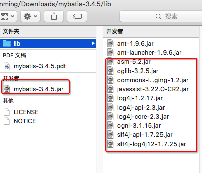
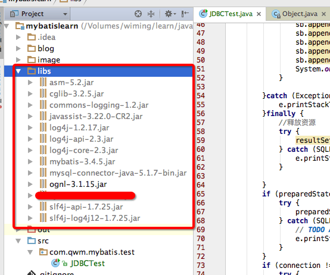
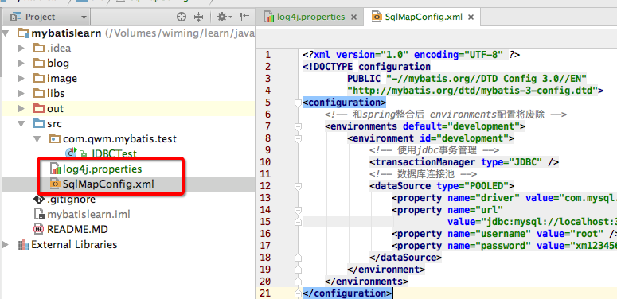
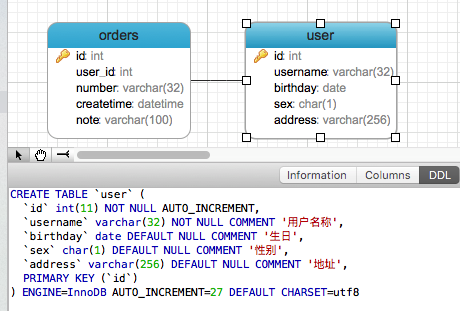
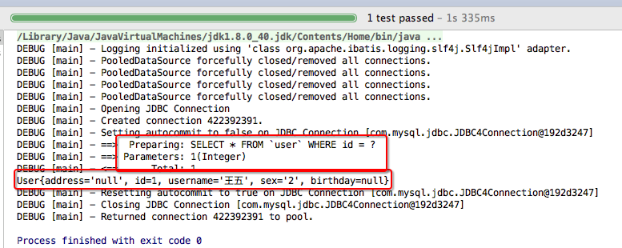

# SSH与SSM学习之MyBatis04——Mybatis基本使用


## 一、1.1.	mybatis下载


下载最新的jar包，地址是

[https://github.com/mybatis/mybatis-3/releases](https://github.com/mybatis/mybatis-3/releases)





---

## 二、导入mybatis包到项目中

需要导入核心包、依赖包、数据库驱动包。如下




---

## 三、加入配置文件

在**src** 下创建 log4j.properties 和 SqlMapConfig.xml 文件
如下

**log4j.properties**

```
# Global logging configuration
log4j.rootLogger=DEBUG, stdout
# Console output...
log4j.appender.stdout=org.apache.log4j.ConsoleAppender
log4j.appender.stdout.layout=org.apache.log4j.PatternLayout
log4j.appender.stdout.layout.ConversionPattern=%5p [%t] - %m%n
```

mybatis默认使用log4j作为输出日志信息。


**SqlMapConfig.xml**

```xml
<?xml version="1.0" encoding="UTF-8" ?>
<!DOCTYPE configuration
        PUBLIC "-//mybatis.org//DTD Config 3.0//EN"
        "http://mybatis.org/dtd/mybatis-3-config.dtd">
<configuration>
    <!-- 和spring整合后 environments配置将废除 -->
    <environments default="development">
        <environment id="development">
            <!-- 使用jdbc事务管理 -->
            <transactionManager type="JDBC" />
            <!-- 数据库连接池 -->
            <dataSource type="POOLED">
                <property name="driver" value="com.mysql.jdbc.Driver" />
                <property name="url"
                          value="jdbc:mysql://localhost:3306/mybatis?characterEncoding=utf-8" />
                <property name="username" value="root" />
                <property name="password" value="xm123456" />
            </dataSource>
        </environment>
    </environments>
</configuration>
```

SqlMapConfig.xml是mybatis核心配置文件，配置文件内容为数据源、事务管理。



图示



---

## 四、创建pojo

pojo类作为mybatis进行sql映射使用，po类通常与数据库表对应

数据表如下



User.java如下

```java

/**
 * @author: qiwenming(杞文明)
 * @date: 18/1/4 上午12:30
 * @className: User
 * @description:
 */
public class User implements Serializable {
    private int id;//id
    private String username;//用户名
    private String sex;//性别
    private Date birthday;//生日
    private String address;//地址
    ......省略get/set方法.......
}       

```

---

## 五、sql映射文件

在**src**的 **sqlmap** 下创建 sql 映射文件 **User.xml**。我们演示，通过id查询一个用户。
如下

```xml
<?xml version="1.0" encoding="UTF-8" ?>
<!DOCTYPE mapper
        PUBLIC "-//mybatis.org//DTD Mapper 3.0//EN"
        "http://mybatis.org/dtd/mybatis-3-mapper.dtd">
<!-- namespace：命名空间，用于隔离sql-->
<mapper namespace="wiming">

    <!-- id:statement的id 或者叫做sql的id-->
    <!-- parameterType:声明输入参数的类型 -->
    <!-- resultType:声明输出结果的类型，应该填写pojo的全路径 -->
    <!-- #{}：输入参数的占位符，相当于jdbc的？ -->
    <select id="queryUserById" parameterType="int"
            resultType="com.qwm.mybatis.pojo.User">
        SELECT * FROM `user` WHERE id  = #{id}
    </select>

</mapper>

```

---

## 六、加载映射文件

在 SqlMapConfig.xml 中加载映射文件,如下

```xml
    <!--加载映射文件-->
    <mappers>
        <mapper resource="sqlmap/User.xml"/>
    </mappers>
```


---

## 七、测试

### 7.1 步骤

 1.创建SqlSessionFactoryBuilder对象
 
 2.加载SqlMapConfig.xml配置文件

 
 3.创建SqlSessionFactory对象

 
 4.创建SqlSession对象

 
 5.执行SqlSession对象执行查询，获取结果User

 
 6.打印结果

 
 7.释放资源


### 7.2 创建测试类

创建一个测试类，如下

```java
/**
 * @author: qiwenming(杞文明)
 * @date: 18/1/4 上午12:41
 * @className: MyBatisTest1
 * @description:
 * MyBatis测试
 */
public class MyBatisTest1 {
    private SqlSessionFactory sqlSessionFactory = null;

    @Before
    public void init() throws Exception{
        //1 创建SqlSessionFactoryBuilder对象
        SqlSessionFactoryBuilder sqlSessionFactoryBuilder = new SqlSessionFactoryBuilder();

        //2 加载SqlMapConfig.xml配置文件
        InputStream inputStream = Resources.getResourceAsStream("SqlMapConfig.xml");

        //3 创建SqlSessionFactory对象
        sqlSessionFactory = sqlSessionFactoryBuilder.build(inputStream);
    }


    @Test
    public void testQueryUserById(){
        //4 创建SqlSession对象
        SqlSession sqlSession = sqlSessionFactory.openSession();

        //5 执行SqlSession对象执行查询，获取结果User
        // 第一个参数是User.xml的statement的id，第二个参数是执行sql需要的参数
        User user = sqlSession.selectOne("wiming.queryUserById",1);

        // 6. 打印结果
        System.out.println(user);

        // 7. 释放资源
        sqlSession.close();
    }
}

```

### 7.3 结果




---

## 八、源码下载

[https://github.com/wimingxxx/mybatislearn](https://github.com/wimingxxx/mybatislearn)


