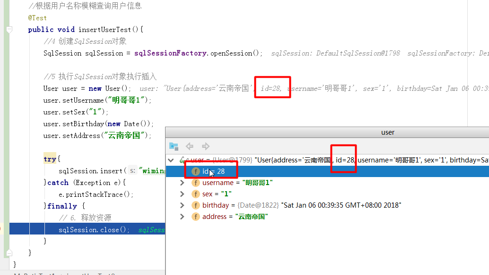

# SSH与SSM学习之MyBatis06——用户添加


## 一、添加用户

添加用户，操作很简单，就是传入用户，通过插入语句，插入即可

### 1.1 User.xml

添加以下的statement

```xml
    <!--添加用户
    #{username}表示从parameterType中获取pojo的属性值
    -->
    <insert id="insertUser" parameterType="com.qwm.mybatis.pojo.User" >
        insert into user(username,birthday,sex,address) values(#{username},#{birthday},#{sex},#{address})
    </insert>
```

### 1.2 测试代码

```java
  //根据用户名称模糊查询用户信息
    @Test
    public void insertUserTest(){
        //4 创建SqlSession对象
        SqlSession sqlSession = sqlSessionFactory.openSession();

        //5 执行SqlSession对象执行插入
        User user = new User();
        user.setUsername("明哥哥");
        user.setSex("1");
        user.setBirthday(new Date());
        user.setAddress("云南帝国");

        try{
            sqlSession.insert("wiming.insertUser",user);
            sqlSession.commit();
        }catch (Exception e){
            e.printStackTrace();
        }finally {
            // 6. 释放资源
            sqlSession.close();
        }
    }
```


### 1.3 结果

```
DEBUG [main] - Setting autocommit to false on JDBC Connection [com.mysql.jdbc.JDBC4Connection@74ad1f1f]
DEBUG [main] - ==>  Preparing: insert into user(username,birthday,sex,address) values(?,?,?,?)
DEBUG [main] - ==> Parameters: 明哥哥(String), 2018-01-05 23:57:48.881(Timestamp), 1(String), 云南帝国(String)
DEBUG [main] - <==    Updates: 1
```

----

## 二、主键返回

往往我们插入数据是相互关联的，这个时候，就需要用到查询数据的主键。现在我们有这么一个需求

需求：user对象插入到数据库后，新记录的主键要通过user对象返回，通过user获取主键值。

### 2.1 自增主键

通过 **LAST_INSERT_ID()** 获取刚插入记录的自增主键值，在insert语句执行后，执行 **select LAST_INSERT_ID()** 就可以获取自增主键。

User.xml

```xml
    <!-- 添加用户
    parameterType：输入 参数的类型，User对象 包括 username,birthday,sex,address
    #{}接收pojo数据，可以使用OGNL解析出pojo的属性值
    #{username}表示从parameterType中获取pojo的属性值
    selectKey：用于进行主键返回，定义了获取主键值的sql
    order：设置selectKey中sql执行的顺序，相对于insert语句来说
    keyProperty：将主键值设置到哪个属性
    resultType：select LAST_INSERT_ID()的结果 类型
     -->
    <insert id="insertUser" parameterType="com.qwm.mybatis.pojo.User" >
        <selectKey keyProperty="id" resultType="int" order="AFTER">
            select LAST_INSERT_ID();
        </selectKey>
        insert into user(username,birthday,sex,address) values(#{username},#{birthday},#{sex},#{address})
    </insert>
```

运行的图示




### 2.2 uuid

使用mysql的uuid机制生成主键：

使用uuid生成主键的好处是不考虑数据库移植后主键冲突问题。

先查询uuid得到主键，将主键设置到user对象中，将user对象插入数据库

```xml
    <insert id="insertUser" parameterType="com.qwm.mybatis.pojo.User" >
        <selectKey keyProperty="id" resultType="String" order="BEFORE">
            select UUID();
        </selectKey>
        insert into user(username,birthday,sex,address) values(#{username},#{birthday},#{sex},#{address})
    </insert>
```


---

## 三、源码下载

[https://github.com/wimingxxx/mybatislearn](https://github.com/wimingxxx/mybatislearn)

