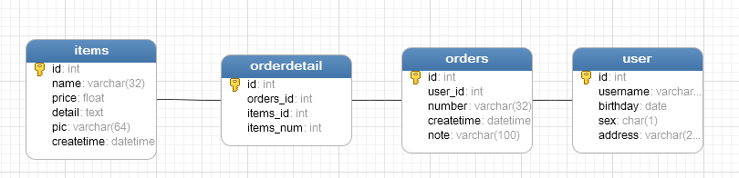
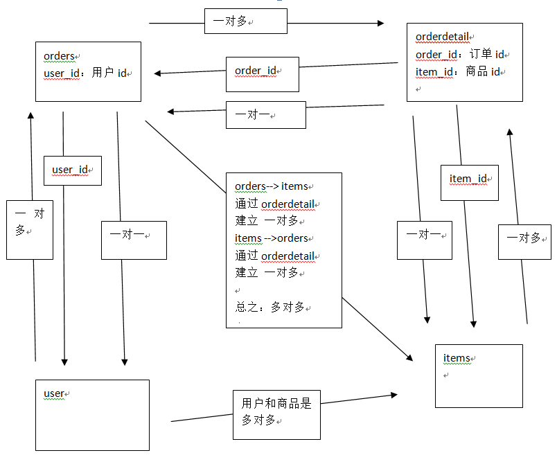

# SSH与SSM学习之MyBatis14——数据模型分析

## 一、如何去分析陌生表的数据模型

1、学习单表记录了什么东西（去学习理解需求）

2、学习单表重要字段的意义（优先学习不能为空的字段）

3、学习表与表之间的关系（一对一、一对多、多对多）

通过表的外键分析表之间的关系

注意：分析表与表之间的关系时是要建立在具体 的业务意义基础之上

---

## 二、表关系分析

目前我们的数据库有4个表，如下

用户表user：
记录了购买商品的用户

订单表orders：
记录了用户所创建的订单信息

订单明细表orderdetail：
记录了用户创建订单的详细信息

商品信息表items：
记录了商家提供的商品信息

**分析表与表之间的关系：**

用户user和订单orders：

>user---->orders：一个用户可以创建多个订单   一对多
>
>orders-->user：一个订单只能由一个用户创建  一对一

订单orders和订单明细orderdetail：

>orders-->orderdetail：一个订单可以包括多个订单明细  一对多
>
>orderdetail-->orders：一个订单明细只属于一个订单  一对一

订单明细orderdetail和商品信息items：

>orderdetail-->items：一个订单明细对应一个商品信息 一对一
>
>items--> orderdetail：一个商品对应多个订单明细  一对多

---

## 三、源码下载

[https://github.com/wimingxxx/mybatislearn](https://github.com/wimingxxx/mybatislearn)

