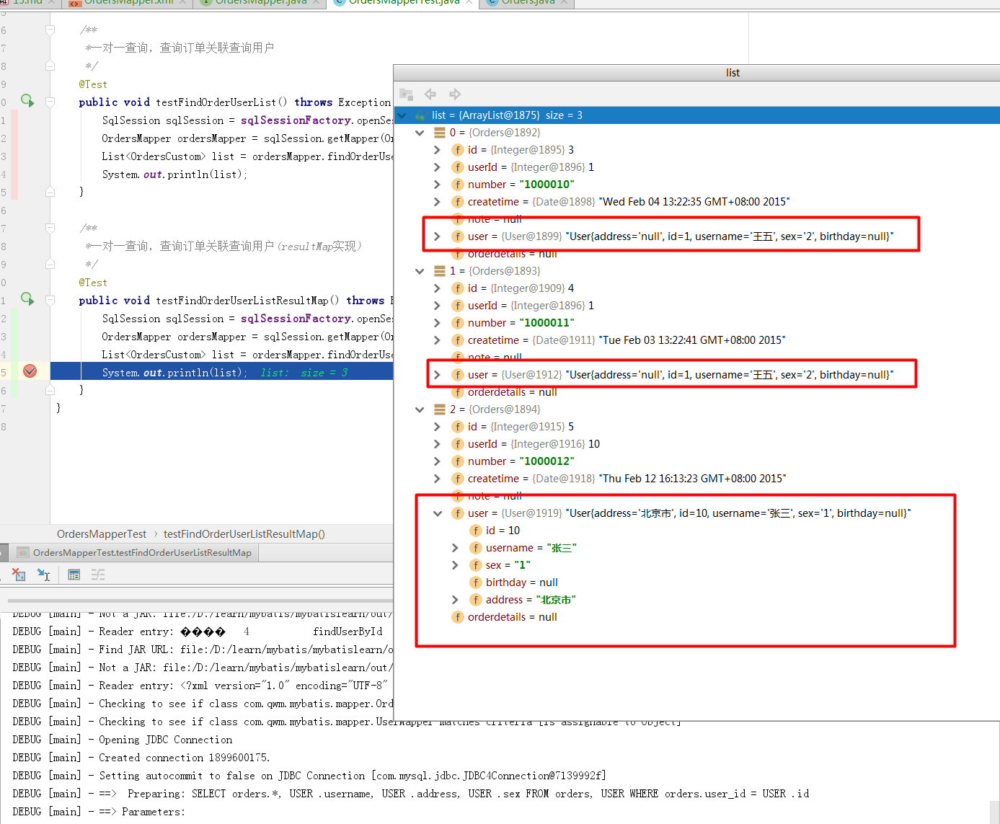

# SSH与SSM学习之MyBatis15——一对一查询


## 一、需求

查询订单信息关联查询用户信息


---

## 二、sql语句

查询语句：
> 1. 先确定主查询表：订单信息表
> 2. 再确定关联查询表：用户信息表

通过orders关联查询用户使用user_id一个外键，只能关联查询出一条用户记录就可以使用内连接

```sql
SELECT
	orders.*,
	USER .username,
  USER .address,
	USER .sex
FROM
	orders,
	USER
WHERE
	orders.user_id = USER .id
```

数据库中的查询结果


---

## 三、使用 resultType 实现

使用 resultType 实现映射，那么就需要创建一个和查询结果相对应的pojo类。

### 3.1 一对一查询映射的pojo

创建pojo包括 订单信息和用户信息，resultType才可以完成映射。

创建OrderCustom作为自定义pojo，继承sql查询列多的po类。

```java
public class OrderCustom extends Orders{
    //补充用户信息
    private String username;
    private String sex;
    private String address;
    ........省略get/set方法.........
}
```

### 3.2 定义mapper.xml

在 com.qwm.mybatis.mapper 下，创建 **OrdersMapper.xml**

创建一个上面的 statement

```xml
<?xml version="1.0" encoding="UTF-8" ?>
<!DOCTYPE mapper
        PUBLIC "-//mybatis.org//DTD Mapper 3.0//EN"
        "http://mybatis.org/dtd/mybatis-3-mapper.dtd">
<!-- namespace：命名空间，用于隔离sql-->
<mapper namespace="com.qwm.mybatis.mapper.OrdersMapper">
    <select id="findOrderUserList" resultType="ordersCustom">
        SELECT
			orders.*,
			USER .username,
			USER .address,
			USER .sex
		FROM
			orders,
			USER
		WHERE
			orders.user_id = USER .id
    </select>
</mapper>
```

### 3.3 创建 mapper.java

创建 OrdersMapper.java 接口

```java
/**
 * @author：qiwenming
 * @date：2018/1/7 0007
 * @description：
 * 订单相关查询的接口
 */
public interface OrdersMapper {
    //一对一查询，查询订单关联查询用户
    List<OrdersCustom> findOrderUserList() throws Exception;
}
```

### 3.4 结果图示


---

## 四、使用 resultMap s实现

### 4.1 resultMap 映射思路

resultMap提供一对一关联查询的映射和一对多关联查询映射，一对一映射思路：将关联查询的信息映射到pojo中，如下：

在Orders类中创建一个User属性，将关联查询的信息映射到User属性中。

```java
public class Orders implements Serializable {
    private Integer id;

    private Integer userId;

    private String number;

    private Date createtime;

    private String note;

    //关联用户信息
    private User user;

    .......省略get/set方法.......

 }
```


### 4.2 mapper.xml

在 OrdersMapper.xml 中创建查询，如下

```xml
	<!--一对一查询，使用resultMap完成
	查询订单关联查询用户信息-->
	<select id="findOrderUserListResultMap" resultMap="ordersUserResultMap">
		SELECT
			orders.*,
			USER .username,
			USER .address,
			USER .sex
		FROM
			orders,
			USER
		WHERE
			orders.user_id = USER .id
	</select>
```

### 4.3 resultMap定义

```xml
	<!--一对一查询resultMap-->
	<resultMap id="ordersUserResultMap" type="orders">
		<!--完成订单信息的映射配置-->
		<id column="id" property="id"/>
		<result column="user_id" property="userId"/>
		<result column="number" property="number"/>
		<result column="createtime" property="createtime"/>
		<result column="note" property="note"/>

		<!--完成关联用户信息的映射配置-->
		<!--
		association：用于对关联信息映射到单个pojo
		property：要将关联信息映射到orders的哪个属性中
		javaType：关联信息映射到orders的属性的类型，是user的类型
		-->
		<association property="user" javaType="user">
			<id column="user_id" property="id"/>
			<result column="username" property="username"/>
			<result column="sex" property="sex"/>
			<result column="address" property="address"/>
		</association>

	</resultMap>
```


### 4.4 mapper.java

```java
    //一对一查询，查询订单关联查询用户(resultMap实现)
    List<OrdersCustom> findOrderUserListResultMap() throws Exception;
```

### 4.5 测试代码

```java
    /**
     *一对一查询，查询订单关联查询用户(resultMap实现)
     */
    @Test
    public void testFindOrderUserListResultMap() throws Exception {
        SqlSession sqlSession = sqlSessionFactory.openSession();
        OrdersMapper ordersMapper = sqlSession.getMapper(OrdersMapper.class);
        List<OrdersCustom> list = ordersMapper.findOrderUserListResultMap();
        System.out.println(list);
    }
```

### 4.6 结果




---

## 五、小结

**resultType**：要自定义pojo 保证sql查询列和pojo的属性对应，这种方法相对较简单，所以应用广泛。

**resultMap**：使用association完成一对一映射需要配置一个resultMap，过程有点复杂，如果要实现延迟加载就只能用resultMap实现 ，如果为了方便对关联信息进行解析，也可以用association将关联信息映射到pojo中方便解析。


----

## 六、源码下载

[https://github.com/wimingxxx/mybatislearn](https://github.com/wimingxxx/mybatislearn)

