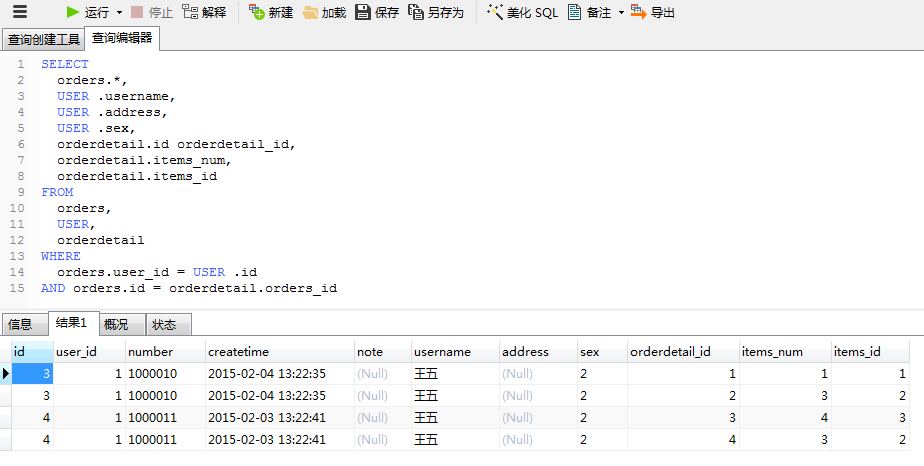
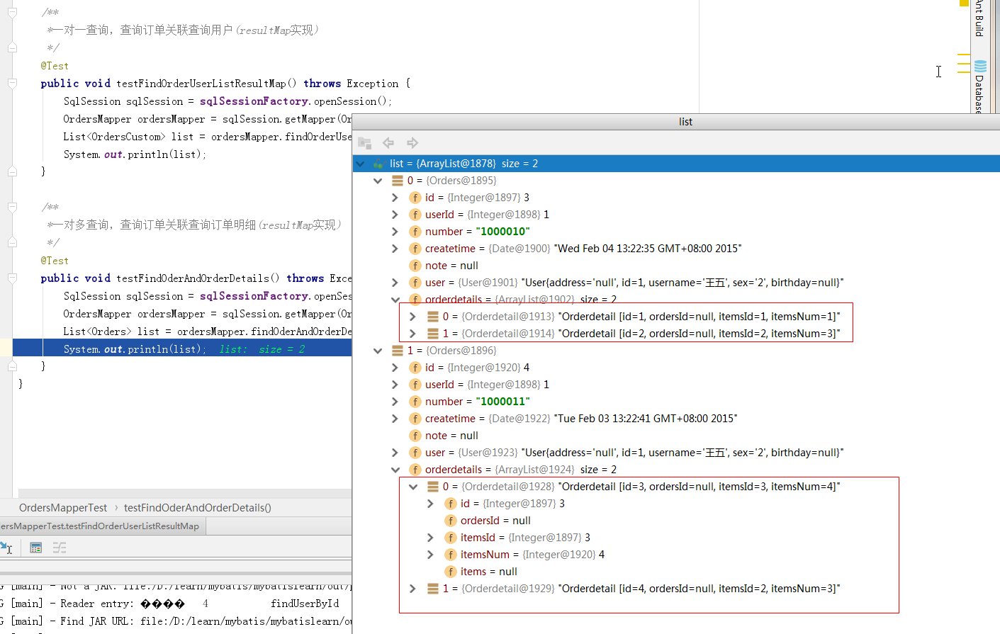

# SSH与SSM学习之MyBatis16——一对多查询(简单)


## 一、需求

查询所有订单信息及订单下的订单明细信息。


---

## 二、sql语句

查询语句：
> 1. 先确定主查询表：订单信息表
> 2. 再确定关联查询表：订单明细表


```sql
SELECT
	orders.*,
	USER .username,
	USER .address,
	USER .sex,
	orderdetail.id orderdetail_id,
	orderdetail.items_num,
	orderdetail.items_id
FROM
	orders,
	USER,
	orderdetail
WHERE
	orders.user_id = USER .id
AND orders.id = orderdetail.orders_id
```

数据库中的查询结果




---

## 三、resultMap进行一对多映射思路

resultMap 提供collection完成关联信息映射到集合对象中。

在orders类中创建集合属性：

```java
public class Orders implements Serializable {
    private Integer id;

    private Integer userId;

    private String number;

    private Date createtime;

    private String note;

    //关联用户信息
    private User user;

    //订单明细
    private List<Orderdetail> orderdetails;

    .......省略get/set方法........
 }
```

## 四、mapper.xml

在 OrdersMapper.xml中添加查询

```xml
	<!--一对多查询使用resultMap完成
	查询订单关联查询订单明细-->
	<select id="findOderAndOrderDetails" resultMap="orderAndOrderDetails">
		SELECT
			orders.*,
			USER .username,
			USER .address,
			USER .sex,
			orderdetail.id orderdetail_id,
			orderdetail.items_num,
			orderdetail.items_id
		FROM
			orders,
			USER,
			orderdetail
		WHERE
			orders.user_id = USER .id
		AND orders.id = orderdetail.orders_id
	</select>
```

---

## 五、resultMap定义

```xml
	<resultMap id="orderAndOrderDetails" type="orders" extends="ordersUserResultMap">
		<!-- 映射订单明细信息
            property：要将关联信息映射到orders的哪个属性中
            ofType：集合中pojo的类型
            -->
		<collection property="orderdetails" ofType="orderdetail">
			<id column="orderdetail_id" property="id"/>
			<result column="items_num" property="itemsNum"/>
			<result column="items_id" property="itemsId"/>
		</collection>
	</resultMap>
```

----

## 六、mapper.java

在 OrdersMapper中添加对应的方法

```java
    //一对多查询，查询订单关联查询订单明细(resultMap实现)
    List<Orders> findOderAndOrderDetails() throws Exception;
```

---

## 七、测试代码

```java
   /**
     *一对多查询，查询订单关联查询订单明细(resultMap实现)
     */
    @Test
    public void testFindOderAndOrderDetails() throws Exception {
        SqlSession sqlSession = sqlSessionFactory.openSession();
        OrdersMapper ordersMapper = sqlSession.getMapper(OrdersMapper.class);
        List<Orders> list = ordersMapper.findOderAndOrderDetails();
        System.out.println(list);
    }
```

---

## 八、结果图示




----

## 九、源码下载

[https://github.com/wimingxxx/mybatislearn](https://github.com/wimingxxx/mybatislearn)

