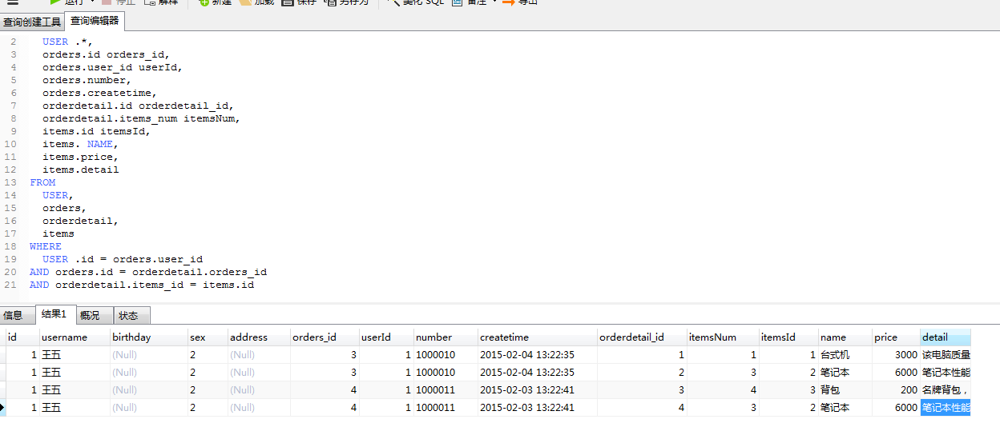
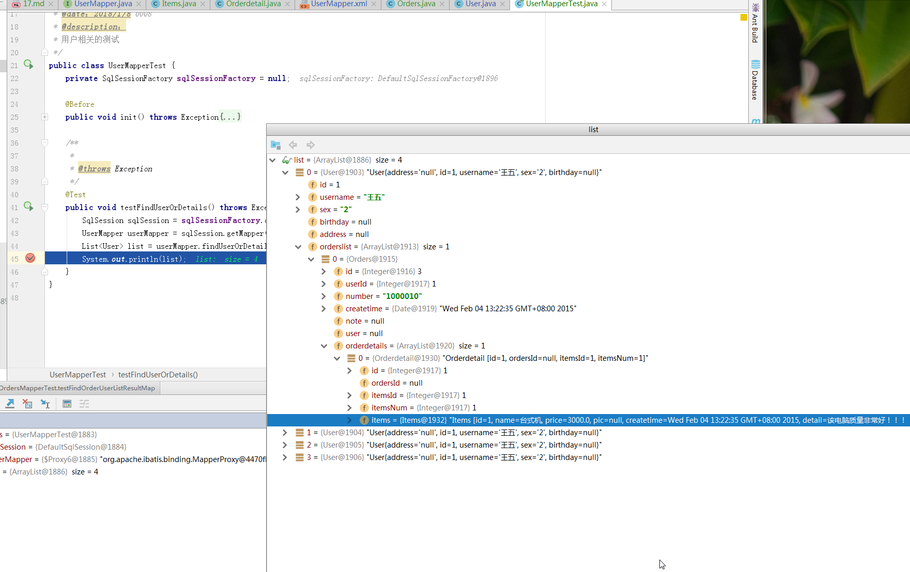

# SSH与SSM学习之MyBatis17——一对多查询(复杂)


## 一、需求

查询所有用户信息，关联查询订单及订单明细信息及商品信息，订单明细信息中关联查询商品信息


---

## 二、sql语句

查询语句：
> 1. 先确定主查询表：用户表
> 2. 再确定关联查询表：订单、订单明细，商品信息


```sql
	USER .*,
  orders.id orders_id,
	orders.user_id userId,
	orders.number,
	orders.createtime,
	orderdetail.id orderdetail_id,
	orderdetail.items_num itemsNum,
	items.id itemsId,
	items. NAME,
	items.price,
	items.detail
FROM
	USER,
	orders,
	orderdetail,
	items
WHERE
	USER .id = orders.user_id
AND orders.id = orderdetail.orders_id
AND orderdetail.items_id = items.id
```

数据库中的查询结果




---

## 三、pojo定义

在user.java中创建映射的属性：集合 List<Orders>  orderlist

在Orders中创建映射的属性：集合List<Orderdetail> orderdetails

在Orderdetail中创建商品属性：pojo   Items items

### 3.1 User.java

```java
public class User implements Serializable {
    private int id;//id
    private String username;//用户名
    private String sex;//性别
    private Date birthday;//生日
    private String address;//地址
    //多个订单
    private List<Orders> orderslist;
    ...........省略set/get...........
 }
```

### 3.2 Orders.java

```java
public class Orders implements Serializable {
    private Integer id;

    private Integer userId;

    private String number;

    private Date createtime;

    private String note;

    //关联用户信息
    private User user;

    //订单明细
    private List<Orderdetail> orderdetails;
    ...........省略set/get...........
 }
```

### 3.3 Orderdetail

```java
public class Orderdetail implements Serializable {
    private Integer id;

    private Integer ordersId;

    private Integer itemsId;

    private Integer itemsNum;

    //商品信息
    private Items items;
    ...........省略set/get...........
 }
```

### 3.4 Items
```java
public class Items implements Serializable {
    private Integer id;

    private String name;

    private Float price;

    private String pic;

    private Date createtime;

    private String detail;
     ...........省略set/get...........
  }
```

--------

## 四、mapper.xml

在 UserMapper.xml 中添加下面的 statement

```xml
    <!--    一对多查询使用resultMap完成
    查询用户及其订单和订单明细，关联商品的信息-->
    <select id="findUserOrDetails" resultMap="userOrDetailResultMap">
        SELECT
            USER .*,
            orders.id orders_id,
            orders.user_id userId,
            orders.number,
            orders.createtime,
            orderdetail.id orderdetail_id,
            orderdetail.items_num itemsNum,
            items.id itemsId,
            items. NAME,
            items.price,
            items.detail
        FROM
            USER,
            orders,
            orderdetail,
            items
        WHERE
            USER .id = orders.user_id
        AND orders.id = orderdetail.orders_id
        AND orderdetail.items_id = items.id
    </select>
```


---

## 五、	resultMap

使用 resultMap 映射的时候，可以使用 **autoMapping** 来自动映射可以匹配的属性，匹配不上的手动映射

```xml
    <resultMap id="userOrDetailResultMap" type="user" autoMapping="true">

        <!--订单信息-->
        <collection property="orderslist" ofType="orders" autoMapping="true">
            <id column="orders_id" property="id"/>
            <!--订单明细-->
            <collection property="orderdetails" ofType="orderdetail" autoMapping="true">
                <id column="orderdetail_id" property="id"/>
                <!--商品详情-->
                <association property="items" javaType="items" autoMapping="true">
                    <id column="itemsId" property="id"/>
                </association>
            </collection>
        </collection>
    </resultMap>
```

----

## 六、mapper.java

在 UserMapper.java接口中添加方法的定义

```java
    /**
     * 查询用户及其订单和订单明细，关联商品的信息
     * @return
     * @throws Exception
     */
    List<User> findUserOrDetails() throws Exception;
```

---

## 七、测试代码

```java
    /**
     *
     * @throws Exception
     */
    @Test
    public void testFindUserOrDetails() throws Exception{
        SqlSession sqlSession = sqlSessionFactory.openSession();
        UserMapper userMapper = sqlSession.getMapper(UserMapper.class);
        List<User> list = userMapper.findUserOrDetails();
        System.out.println(list);
    }
```

---

## 八、结果图示




----

## 九、源码下载

[https://github.com/wimingxxx/mybatislearn](https://github.com/wimingxxx/mybatislearn)

