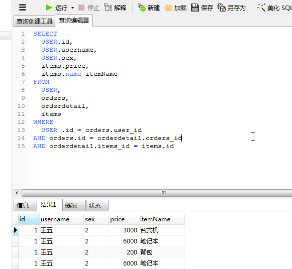
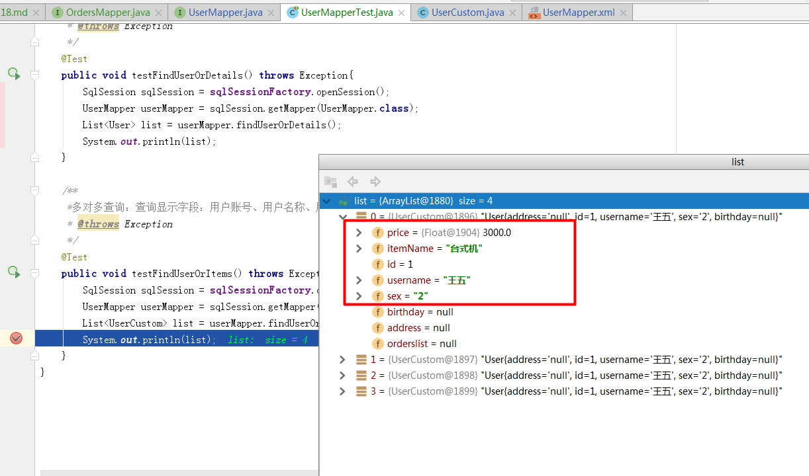

# SSH与SSM学习之MyBatis18——多对多查询(resultType)


## 一、需求和分析

### 1.1 需求

查询显示字段：用户账号、用户名称、用户性别、商品名称、商品价格(最常见)
企业开发中常见明细列表，用户购买商品明细列表，

### 1.2 分析

这里面数据中没有集合的情况，我们可以

**使用resultType将上边查询列映射到pojo输出。**


---

## 二、sql语句

查询语句：
> 1. 先确定主查询表：用户表
> 2. 再确定关联查询表：订单、订单明细，商品信息


```sql
SELECT
	USER.id,
	USER.username,
	USER.sex,
	items.price,
	items.name itemName
FROM
	USER,
	orders,
	orderdetail,
	items
WHERE
	USER .id = orders.user_id
AND orders.id = orderdetail.orders_id
AND orderdetail.items_id = items.id
```

数据库中的查询结果




---

## 三、pojo定义

这里面我们可以定义一个类，让它继承 **User类**，添加 商品名称、商品价格属性

```java
public class UserCustom extends User {
    private Float price;//商品价格
    private String itemName;//商品名称
    ................省略get/set方法................
}
```

--------

## 四、mapper.xml

在 UserMapper.xml 中添加下面的 statement

```xml
    <!--多对多查询：
    查询显示字段：用户账号、用户名称、用户性别、商品名称、商品价格(最常见)-->
    <select id="findUserOrItems" resultType="userCustom">
        SELECT
            USER.id,
            USER.username,
            USER.sex,
            items.price,
            items.name itemName
        FROM
            USER,
            orders,
            orderdetail,
            items
        WHERE
            USER .id = orders.user_id
        AND orders.id = orderdetail.orders_id
        AND orderdetail.items_id = items.id
    </select>
```

----

## 五、mapper.java

在 UserMapper.java接口中添加方法的定义

```java
    /**
     * 多对多查询：查询显示字段：用户账号、用户名称、用户性别、商品名称、商品价格(最常见
     * @return
     * @throws Exception
     */
    List<UserCustom> findUserOrItems() throws Exception;
```

---

## 六、测试代码

```java
    /**
     *多对多查询：查询显示字段：用户账号、用户名称、用户性别、商品名称、商品价格(最常见
     * @throws Exception
     */
    @Test
    public void testFindUserOrItems() throws Exception{
        SqlSession sqlSession = sqlSessionFactory.openSession();
        UserMapper userMapper = sqlSession.getMapper(UserMapper.class);
        List<UserCustom> list = userMapper.findUserOrItems();
        System.out.println(list);
    }
```

---

## 七、结果图示




----

## 八、源码下载

[https://github.com/wimingxxx/mybatislearn](https://github.com/wimingxxx/mybatislearn)

