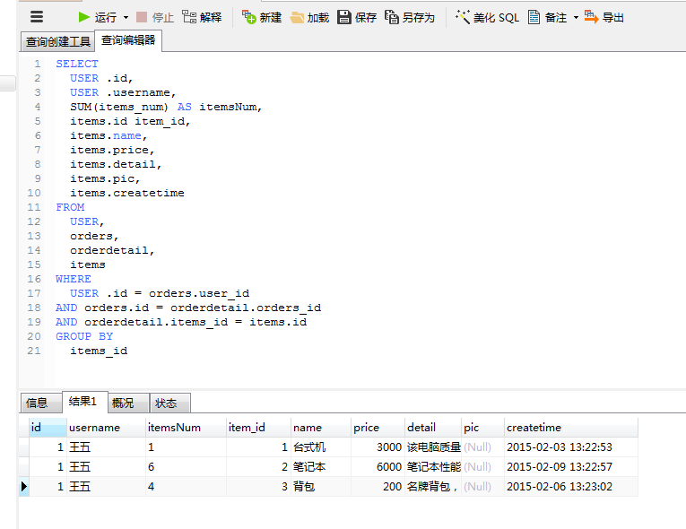
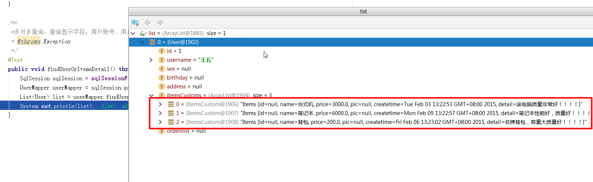

# SSH与SSM学习之MyBatis19——多对多查询(resultMap)


## 一、需求和分析

### 1.1 需求

查询显示字段：用户账号、用户名称、购买商品数量、商品明细

### 1.2 分析

**使用resultMap将用户购买的商品明细列表映射到user对象中。**


---

## 二、sql语句

查询语句：
> 1. 先确定主查询表：用户表
> 2. 再确定关联查询表：订单、订单明细，商品信息


```sql
SELECT
	USER .id,
	USER .username,
	SUM(items_num) AS itemsNum,
	items.id itemId,
	items.name,
	items.price,
	items.detail,
	items.pic,
	items.createtime
FROM
	USER,
	orders,
	orderdetail,
	items
WHERE
	USER .id = orders.user_id
AND orders.id = orderdetail.orders_id
AND orderdetail.items_id = items.id
GROUP BY
	items_id
```

数据库中的查询结果




---

## 三、pojo定义

购买商品数量、商品明细,可以定义一个类，让它继承 **Items类**，添加购买商品数量属性

```java
public class ItemsCustom extends Items{
    private int itemsNum;
    ................省略get/set方法................
}
```

修改用户类，让用户类包含一个 ItemsCustom 的集合数据

```java
public class User implements Serializable {
    private int id;//id
    private String username;//用户名
    private String sex;//性别
    private Date birthday;//生日
    private String address;//地址
    private List<ItemsCustom> itemsCustoms;
    ................省略get/set方法................
}
```

--------

## 四、mapper.xml

在 UserMapper.xml 中添加下面的 statement

```xml
    <!--多对多查询：查询显示字段：用户账号、用户名称、购买商品数量、商品明细-->
    <select id="findUserOrItemsDetail" resultMap="userOrItemsDetailResultMap">
        SELECT
            USER .id,
            USER .username,
            SUM(items_num) AS itemsNum,
            items.id itemId,
            items.name,
            items.price,
            items.detail,
            items.pic,
            items.createtime
        FROM
            USER,
            orders,
            orderdetail,
            items
        WHERE
            USER .id = orders.user_id
        AND orders.id = orderdetail.orders_id
        AND orderdetail.items_id = items.id
        GROUP BY
	        items_id
    </select>
```

---

## 五、resultMap

```xml
    <resultMap id="userOrItemsDetailResultMap" type="user" autoMapping="true">
        <id column="id" property="id"/>
        <collection property="itemsCustoms" ofType="itemsCustom" autoMapping="true">
            <id column="item_id" property="id"/>
        </collection>
    </resultMap>
```

----

## 六、mapper.java

在 UserMapper.java接口中添加方法的定义

```java
    /**
     * 多对多查询：查询显示字段：用户账号、用户名称、用户性别、商品名称、商品价格(最常见
     * @return
     * @throws Exception
     */
    List<UserCustom> findUserOrItems() throws Exception;
```

---

## 七、测试代码

```java
    /**
     *多对多查询：查询显示字段：用户账号、用户名称、购买商品数量、商品明细
     * @throws Exception
     */
    @Test
    public void findUserOrItemsDetail() throws Exception{
        SqlSession sqlSession = sqlSessionFactory.openSession();
        UserMapper userMapper = sqlSession.getMapper(UserMapper.class);
        List<User> list = userMapper.findUserOrItemsDetail();
        System.out.println(list);
    }
```

---

## 八、结果图示




----

## 九、源码下载

[https://github.com/wimingxxx/mybatislearn](https://github.com/wimingxxx/mybatislearn)

