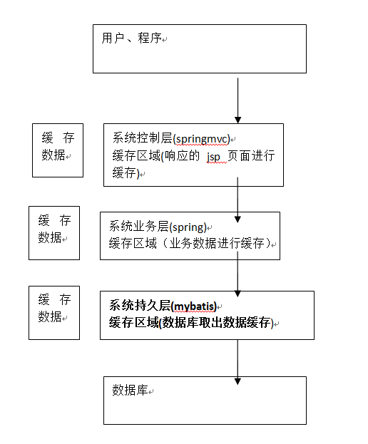
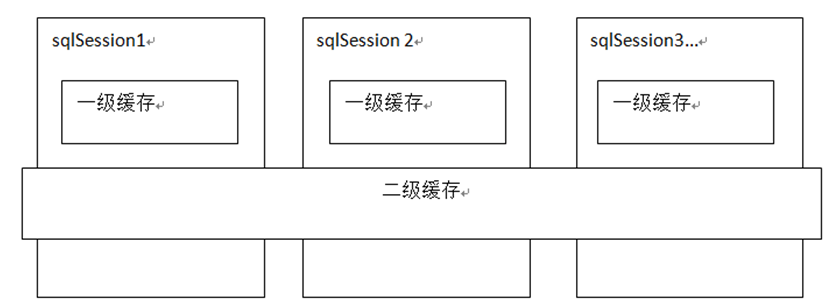
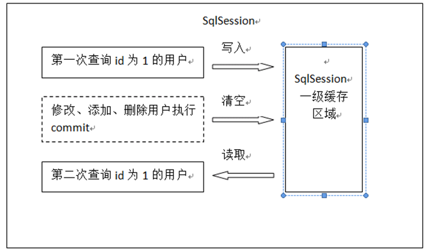

# SSH与SSM学习之MyBatis22——一级缓存


## 一、缓存的意义

将用户经常查询的数据放在缓存（内存）中，用户去查询数据就不用从磁盘上(关系型数据库数据文件)查询，

从缓存中查询，从而提高查询效率，解决了高并发系统的性能问题。




---

## 二、mybatis持久层缓存

mybatis提供一级缓存和二级缓存



mybatis一级缓存是一个SqlSession级别，sqlsession只能访问自己的一级缓存的数据，

二级缓存是跨sqlSession，是mapper级别的缓存，对于mapper级别的缓存不同的sqlsession是可以共享的。

---

## 三、一级缓存

### 3.1 一级缓存原理



第一次发出一个查询sql，sql查询结果写入sqlsession的一级缓存中，缓存使用的数据结构是一个 **map<key,value>**

> key：hashcode+sql+sql输入参数+输出参数（sql的唯一标识）
>
> value：用户信息

同一个sqlsession再次发出相同的sql，就从缓存中取不走数据库。

如果两次中间出现commit操作（修改、添加、删除），本sqlsession中的一级缓存区域全部清空，

下次再去缓存中查询不到所以要从数据库查询，从数据库查询到再写入缓存。

每次查询都先从缓存中查询，如果缓存中查询不到就从数据库查询：

**org.apache.ibatis.executor.BaseExecutor** 中 **query**方法

```java
........
try {
      queryStack++;
      list = resultHandler == null ? (List<E>) localCache.getObject(key) : null;
      if (list != null) {
        handleLocallyCachedOutputParameters(ms, key, parameter, boundSql);
      } else {
        list = queryFromDatabase(ms, parameter, rowBounds, resultHandler, key, boundSql);
      }
    }
 ......
```


### 3.2 一级缓存配置

mybatis默认支持一级缓存不需要配置。

注意：mybatis和spring整合后进行mapper代理开发，不支持一级缓存，mybatis和spring整合，

spring按照mapper的模板去生成mapper代理对象，模板中在最后统一关闭sqlsession。

### 3.3 一级缓存测试

```java
    /**
     * 一级缓存测试
     * @throws Exception
     */
    @Test
    public void testCahce1() throws Exception{
        SqlSession sqlSession = sqlSessionFactory.openSession();
        UserMapper userMapper = sqlSession.getMapper(UserMapper.class);

        //第一次查询用户id为1的用户
        User user= userMapper.findUserById(1);
        System.out.println(user);

        System.out.println("------------华丽的分割线--------------");

        //第二次查询用户id为1的用户
        User user1= userMapper.findUserById(1);
        System.out.println(user1);
    }
```

### 3.4 一级缓存测试结果

```
DEBUG [main] - Setting autocommit to false on JDBC Connection [com.mysql.jdbc.JDBC4Connection@1068e947]
DEBUG [main] - ==>  Preparing: SELECT * FROM `user` WHERE id = ?
DEBUG [main] - ==> Parameters: 1(Integer)
DEBUG [main] - <==      Total: 1
com.qwm.mybatis.pojo.User@17695df3
------------华丽的分割线--------------
com.qwm.mybatis.pojo.User@17695df3
```


---

## 四、源码下载

[https://github.com/wimingxxx/mybatislearn](https://github.com/wimingxxx/mybatislearn)

