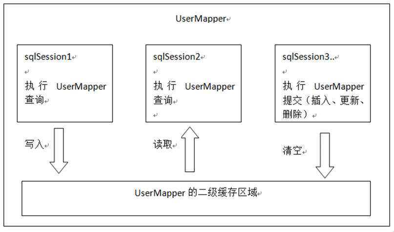

# SSH与SSM学习之MyBatis23——二级缓存


## 一、二级缓存原理

将用户经常查询的数据放在缓存（内存）中，用户去查询数据就不用从磁盘上(关系型数据库数据文件)查询，

从缓存中查询，从而提高查询效率，解决了高并发系统的性能问题。



二级缓存的范围是mapper级别（mapper同一个命名空间），mapper以命名空间为单位创建缓存数据结构，结构是map<key、value>。

每次查询先看是否开启二级缓存，如果开启从二级缓存的数据结构中取缓存数据，

如果从二级缓存没有取到，再从一级缓存中找，如果一级缓存也没有，从数据库查询。

---

## 二、二级缓存配置

在核心配置文件SqlMapConfig.xml中加入

```xml
<setting name="cacheEnabled" value="true"/>
```
|	|描述|	允许值|	默认值|
|---|---|---|---|
|cacheEnabled	| 对在此配置文件下的所有cache 进行全局性开/关设置。 |	true false |	true|

要在对应的Mapper映射文件中添加一行：
 ```xml
 <cache />
 ````
表示此mapper开启二级缓存。

---

## 三、查询结果映射的pojo序列化

mybatis二级缓存需要将查询结果映射的pojo实现 **java.io.serializable接口**，如果不实现则抛出异常：
```java
org.apache.ibatis.cache.CacheException: Error serializing object.
 Cause: java.io.NotSerializableException: com.qwm.mybatis.pojo.User
```

二级缓存可以将内存的数据写到磁盘，存在对象的序列化和反序列化，所以要实现java.io.serializable接口。
如果结果映射的pojo中还包括了pojo，都要实现java.io.serializable接口。

```java
public class User implements Serializable {
    private int id;//id
    private String username;//用户名
    private String sex;//性别
    private Date birthday;//生日
    private String address;//地址
    ...
}
```

----

## 四、二级缓存禁用

对于变化频率较高的sql，需要禁用二级缓存：

在statement中设置 **useCache=false** 可以禁用当前select语句的二级缓存，

即每次查询都会发出sql去查询，默认情况是true，即该sql使用二级缓存。

```xml
<select id="findOrderListResultMap" resultMap="ordersUserMap" useCache="false">
```

---

## 五、刷新缓存

如果sqlsession操作commit操作，对二级缓存进行刷新（全局清空）。

设置statement的flushCache是否刷新缓存，默认值是true。


---

## 六、测试代码

```java
    /**
     * 二级缓存
     * @throws Exception
     */
    @Test
    public void testCache2() throws Exception{
        SqlSession sqlSession1 = sqlSessionFactory.openSession();
        SqlSession sqlSession2 = sqlSessionFactory.openSession();
        SqlSession sqlSession3 = sqlSessionFactory.openSession();
        UserMapper userMapper1 = sqlSession1.getMapper(UserMapper.class);
        UserMapper userMapper2 = sqlSession2.getMapper(UserMapper.class);
        UserMapper userMapper3 = sqlSession3.getMapper(UserMapper.class);

        //第一次查询用户为1的用户
        User user1 = userMapper1.findUserById(1);
        System.out.println(user1);
        sqlSession1.close();

        System.out.println("-----------------");

        //第二次查询用户为1的用户
        User user2 = userMapper2.findUserById(1);
        System.out.println(user2);

        System.out.println("-----------------");

        //修改数据，修改数据
        user2.setUsername("测试用户明哥哥");
        userMapper2.updateUser(user2);
        sqlSession2.commit();
        sqlSession2.close();

        System.out.println("-----------------");

        //第三次查询用户为1的用户
        User user3 = userMapper3.findUserById(1);
        System.out.println(user3);
        sqlSession3.close();
    }
```

---

## 七、测试结果

```
DEBUG [main] - Cache Hit Ratio [com.qwm.mybatis.mapper.UserMapper]: 0.0
DEBUG [main] - Opening JDBC Connection
DEBUG [main] - Created connection 1765250898.
DEBUG [main] - Setting autocommit to false on JDBC Connection [com.mysql.jdbc.JDBC4Connection@69379752]
DEBUG [main] - ==>  Preparing: SELECT * FROM `user` WHERE id = ?
DEBUG [main] - ==> Parameters: 1(Integer)
DEBUG [main] - <==      Total: 1
com.qwm.mybatis.pojo.User@276438c9
DEBUG [main] - Resetting autocommit to true on JDBC Connection [com.mysql.jdbc.JDBC4Connection@69379752]
DEBUG [main] - Closing JDBC Connection [com.mysql.jdbc.JDBC4Connection@69379752]
DEBUG [main] - Returned connection 1765250898 to pool.
-----------------
DEBUG [main] - Cache Hit Ratio [com.qwm.mybatis.mapper.UserMapper]: 0.5
com.qwm.mybatis.pojo.User@4d339552
-----------------
DEBUG [main] - Opening JDBC Connection
DEBUG [main] - Checked out connection 1765250898 from pool.
DEBUG [main] - Setting autocommit to false on JDBC Connection [com.mysql.jdbc.JDBC4Connection@69379752]
DEBUG [main] - ==>  Preparing: update user set username=?,birthday=?,sex=?,address=? where id=?
DEBUG [main] - ==> Parameters: 测试用户明哥哥(String), null, 2(String), null, 1(Integer)
DEBUG [main] - <==    Updates: 1
DEBUG [main] - Committing JDBC Connection [com.mysql.jdbc.JDBC4Connection@69379752]
DEBUG [main] - Resetting autocommit to true on JDBC Connection [com.mysql.jdbc.JDBC4Connection@69379752]
DEBUG [main] - Closing JDBC Connection [com.mysql.jdbc.JDBC4Connection@69379752]
DEBUG [main] - Returned connection 1765250898 to pool.
-----------------
DEBUG [main] - Cache Hit Ratio [com.qwm.mybatis.mapper.UserMapper]: 0.3333333333333333
DEBUG [main] - Opening JDBC Connection
DEBUG [main] - Checked out connection 1765250898 from pool.
DEBUG [main] - Setting autocommit to false on JDBC Connection [com.mysql.jdbc.JDBC4Connection@69379752]
DEBUG [main] - ==>  Preparing: SELECT * FROM `user` WHERE id = ?
DEBUG [main] - ==> Parameters: 1(Integer)
DEBUG [main] - <==      Total: 1
com.qwm.mybatis.pojo.User@6591f517
DEBUG [main] - Resetting autocommit to true on JDBC Connection [com.mysql.jdbc.JDBC4Connection@69379752]
DEBUG [main] - Closing JDBC Connection [com.mysql.jdbc.JDBC4Connection@69379752]
DEBUG [main] - Returned connection 1765250898 to pool.
```

---

## 八、源码下载

[https://github.com/wimingxxx/mybatislearn](https://github.com/wimingxxx/mybatislearn)

