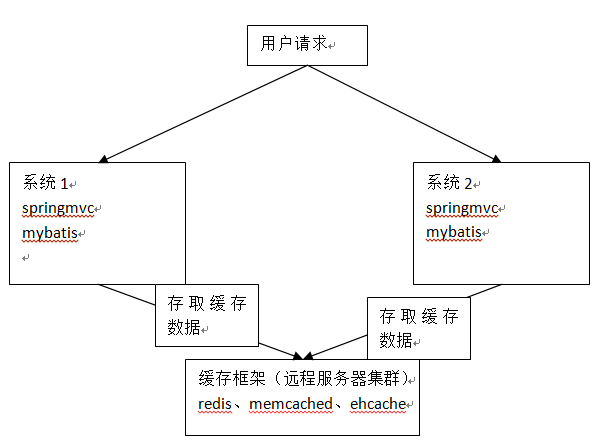

# SSH与SSM学习之MyBatis24——mybatis和ehcache缓存框架整合

mybatis二级缓存通过ehcache维护缓存数据。

## 一、分布缓存





---

## 二、mybatis和ehcache思路

通过mybatis和ehcache框架进行整合，就可以把缓存数据的管理托管给ehcache。

在mybatis中提供一个cache接口，只要实现cache接口就可以把缓存数据灵活的管理起来。

```java
package org.apache.ibatis.cache;

import java.util.concurrent.locks.ReadWriteLock;

/**
 * SPI for cache providers.
 *
 * One instance of cache will be created for each namespace.
 *
 * The cache implementation must have a constructor that receives the cache id as an String parameter.
 *
 * MyBatis will pass the namespace as id to the constructor.
 *
 * <pre>
 * public MyCache(final String id) {
 *  if (id == null) {
 *    throw new IllegalArgumentException("Cache instances require an ID");
 *  }
 *  this.id = id;
 *  initialize();
 * }
 * </pre>
 *
 * @author Clinton Begin
 */

public interface Cache {

  /**
   * @return The identifier of this cache
   */
  String getId();

  /**
   * @param key Can be any object but usually it is a {@link CacheKey}
   * @param value The result of a select.
   */
  void putObject(Object key, Object value);

  /**
   * @param key The key
   * @return The object stored in the cache.
   */
  Object getObject(Object key);

  /**
   * @param key The key
   * @return Not used
   */
  Object removeObject(Object key);

  /**
   * Clears this cache instance
   */
  void clear();

  /**
   * Optional. This method is not called by the core.
   *
   * @return The number of elements stored in the cache (not its capacity).
   */
  int getSize();

  /**
   * Optional. As of 3.2.6 this method is no longer called by the core.
   *
   * Any locking needed by the cache must be provided internally by the cache provider.
   *
   * @return A ReadWriteLock
   */
  ReadWriteLock getReadWriteLock();

}
```

mybatis中默认实现：

```java
package org.apache.ibatis.cache.impl;

import java.util.HashMap;
import java.util.Map;
import java.util.concurrent.locks.ReadWriteLock;

import org.apache.ibatis.cache.Cache;
import org.apache.ibatis.cache.CacheException;

/**
 * @author Clinton Begin
 */
public class PerpetualCache implements Cache {

  private final String id;

  private Map<Object, Object> cache = new HashMap<Object, Object>();

  public PerpetualCache(String id) {
    this.id = id;
  }

  @Override
  public String getId() {
    return id;
  }

  @Override
  public int getSize() {
    return cache.size();
  }

  @Override
  public void putObject(Object key, Object value) {
    cache.put(key, value);
  }

  @Override
  public Object getObject(Object key) {
    return cache.get(key);
  }

  @Override
  public Object removeObject(Object key) {
    return cache.remove(key);
  }

  @Override
  public void clear() {
    cache.clear();
  }

  @Override
  public ReadWriteLock getReadWriteLock() {
    return null;
  }

  @Override
  public boolean equals(Object o) {
    if (getId() == null) {
      throw new CacheException("Cache instances require an ID.");
    }
    if (this == o) {
      return true;
    }
    if (!(o instanceof Cache)) {
      return false;
    }

    Cache otherCache = (Cache) o;
    return getId().equals(otherCache.getId());
  }

  @Override
  public int hashCode() {
    if (getId() == null) {
      throw new CacheException("Cache instances require an ID.");
    }
    return getId().hashCode();
  }

}
````


---

## 三、下载和ehcache整合的jar包

### 3.1 ehcache下载

下载地址 [http://www.ehcache.org/downloads/](http://www.ehcache.org/downloads/)

### 3.2 mybatis-ehcache下载

下载地址 [https://github.com/mybatis/ehcache-cache/releases](https://github.com/mybatis/ehcache-cache/releases)


ehcache对cache接口的实现类

```java
package org.mybatis.caches.ehcache;

import java.util.concurrent.locks.ReadWriteLock;
import net.sf.ehcache.CacheManager;
import net.sf.ehcache.Ehcache;
import net.sf.ehcache.Element;
import org.apache.ibatis.cache.Cache;

public final class EhcacheCache implements Cache {
    private static final CacheManager CACHE_MANAGER = CacheManager.create();
    private final String id;
    private final Ehcache cache;
    private final ReadWriteLock readWriteLock = new DummyReadWriteLock();

    public EhcacheCache(String id) {
        if (id == null) {
            throw new IllegalArgumentException("Cache instances require an ID");
        } else {
            if (!CACHE_MANAGER.cacheExists(id)) {
                CACHE_MANAGER.addCache(id);
            }

            this.cache = CACHE_MANAGER.getCache(id);
            this.id = id;
        }
    }

    public void clear() {
        this.cache.removeAll();
    }

    public String getId() {
        return this.id;
    }

    public Object getObject(Object key) {
        Element cachedElement = this.cache.get(key);
        return cachedElement == null ? null : cachedElement.getObjectValue();
    }

    public ReadWriteLock getReadWriteLock() {
        return this.readWriteLock;
    }

    public int getSize() {
        return this.cache.getSize();
    }

    public void putObject(Object key, Object value) {
        this.cache.put(new Element(key, value));
    }

    public Object removeObject(Object key) {
        Object obj = this.getObject(key);
        this.cache.remove(key);
        return obj;
    }

    public boolean equals(Object obj) {
        if (this == obj) {
            return true;
        } else if (obj == null) {
            return false;
        } else if (!(obj instanceof Cache)) {
            return false;
        } else {
            Cache otherCache = (Cache)obj;
            return this.id.equals(otherCache.getId());
        }
    }

    public int hashCode() {
        return this.id.hashCode();
    }

    public String toString() {
        return "EHCache {" + this.id + "}";
    }

    public void setTimeToIdleSeconds(long timeToIdleSeconds) {
        this.cache.getCacheConfiguration().setTimeToIdleSeconds(timeToIdleSeconds);
    }

    public void setTimeToLiveSeconds(long timeToLiveSeconds) {
        this.cache.getCacheConfiguration().setTimeToLiveSeconds(timeToLiveSeconds);
    }

    public void setMaxEntriesLocalHeap(long maxEntriesLocalHeap) {
        this.cache.getCacheConfiguration().setMaxEntriesLocalHeap(maxEntriesLocalHeap);
    }

    public void setMaxEntriesLocalDisk(long maxEntriesLocalDisk) {
        this.cache.getCacheConfiguration().setMaxEntriesLocalDisk(maxEntriesLocalDisk);
    }

    public void setMemoryStoreEvictionPolicy(String memoryStoreEvictionPolicy) {
        this.cache.getCacheConfiguration().setMemoryStoreEvictionPolicy(memoryStoreEvictionPolicy);
    }
}
```

----

## 四、配置ehcache.xml

```xml
<ehcache xmlns:xsi="http://www.w3.org/2001/XMLSchema-instance"
         xsi:noNamespaceSchemaLocation="../lib/ehcache-3.4.0.jar">
    <!--diskStore：缓存数据持久化的目录 地址  -->
    <diskStore path="F:\develop\ehcache" />
    <defaultCache
            maxElementsInMemory="1000"
            maxElementsOnDisk="10000000"
            eternal="false"
            overflowToDisk="false"
            diskPersistent="true"
            timeToIdleSeconds="120"
            timeToLiveSeconds="120"
            diskExpiryThreadIntervalSeconds="120"
            memoryStoreEvictionPolicy="LRU">
    </defaultCache>
</ehcache>
```


---

## 五、在mapper.xml添加ehcache配置

```xml
    <!-- 开启二级缓存 -->
    <!-- 单位：毫秒 -->
    <cache type="org.mybatis.caches.ehcache.EhcacheCache">
        <property name="timeToIdleSeconds" value="12000"/>
        <property name="timeToLiveSeconds" value="3600"/>
        <!-- 同ehcache参数maxElementsInMemory -->
        <property name="maxEntriesLocalHeap" value="1000"/>
        <!-- 同ehcache参数maxElementsOnDisk -->
        <property name="maxEntriesLocalDisk" value="10000000"/>
        <property name="memoryStoreEvictionPolicy" value="LRU"/>
    </cache>
```

----

## 六、二级缓存的应用场景

对查询频率高，变化频率低的数据建议使用二级缓存。

对于访问多的查询请求且用户对查询结果实时性要求不高，此时可采用mybatis二级缓存技术降低数据库访问量，提高访问速度，业务场景比如：耗时较高的统计分析sql、电话账单查询sql等。

实现方法如下：通过设置刷新间隔时间，由mybatis每隔一段时间自动清空缓存，根据数据变化频率设置缓存刷新间隔flushInterval，比如设置为30分钟、60分钟、24小时等，根据需求而定。

---

## 七、mybatis局限性

mybatis二级缓存对细粒度的数据级别的缓存实现不好，比如如下需求：对商品信息进行缓存，由于商品信息查询访问量大，

但是要求用户每次都能查询最新的商品信息，此时如果使用mybatis的二级缓存就无法实现当一个商品变化时只刷新该商品的

缓存信息而不刷新其它商品的信息，因为mybaits的二级缓存区域以mapper为单位划分，当一个商品信息变化会将所有商品信息

的缓存数据全部清空。解决此类问题需要在业务层根据需求对数据有针对性缓存。

---

## 八、源码下载

[https://github.com/wimingxxx/mybatislearn](https://github.com/wimingxxx/mybatislearn)

